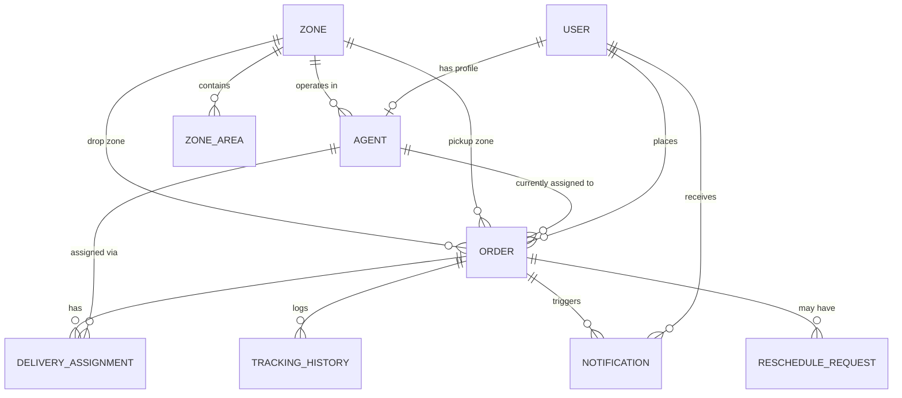

# Database Schema & Data Model

## 1. Overview

The Last-Mile Delivery Tracker uses a relational data model that separates five concerns: user identity, delivery operations, pricing configuration, agent assignment, and historical/audit records (tracking, notifications, rescheduling). Keeping these concerns in distinct tables — rather than overloading `Order` with mutable history — is the schema's central design principle.

The backend uses **SQLAlchemy ORM** for data access. Tables are currently created via SQLAlchemy metadata (`Base.metadata.create_all()`); versioned migrations (e.g. Alembic) are a planned addition rather than part of the current setup.

## 2. Core Entities

### 2.1 User

Represents every authenticated account in the system, regardless of role.

| Field | Purpose |
|---|---|
| `id` | Primary key |
| `name` | Display name |
| `email` | Login credential and contact address |
| `phone` | Contact number |
| `password_hash` | Bcrypt-hashed password (plaintext is never stored) |
| `role` | `CUSTOMER`, `AGENT`, or `ADMIN` |
| `created_at` | Account creation timestamp |

A single `User` table serves all three roles; an `AGENT`-role user additionally owns one `Agent` profile holding delivery-specific operational data.

### 2.2 Agent

Delivery-agent-specific operational state, one-to-one with a `User` of role `AGENT`.

| Field | Purpose |
|---|---|
| `id` | Primary key |
| `user_id` | Associated user account (FK → `User`) |
| `zone_id` | Operational zone (FK → `Zone`) |
| `current_latitude` / `current_longitude` | Current location, used for nearest-agent assignment |
| `availability_status` | `AVAILABLE`, `BUSY`, or `OFFLINE` |
| `created_at` | Profile creation timestamp |

`availability_status` is the gate for auto-assignment eligibility: only `AVAILABLE` agents with valid coordinates are considered.

### 2.3 Order

The central operational entity — a customer's delivery request and its current state.

| Field | Purpose |
|---|---|
| `id` | Primary key |
| `customer_id` | Requesting customer (FK → `User`) |
| `pickup_address` / `drop_address` | Free-text addresses |
| `pickup_zone_id` / `drop_zone_id` | Resolved zones (FK → `Zone`, one each) |
| `length` / `breadth` / `height` | Package dimensions (cm) |
| `actual_weight` / `volumetric_weight` / `billable_weight` | Weight inputs and derived billable weight |
| `order_type` | `B2B` or `B2C` |
| `payment_type` | `PREPAID` or `COD` |
| `base_charge` / `cod_charge` / `total_charge` | Computed pricing breakdown |
| `agent_id` | Currently assigned agent (FK → `Agent`, nullable) |
| `current_status` | Latest lifecycle state |
| `created_at` / `updated_at` | Timestamps |

`current_status` reflects only the *latest* state — the full history of how the order reached that state lives separately in `TrackingHistory` (see §2.5). This separation is deliberate: overwriting a single status field would destroy the audit trail the assignment explicitly requires.

### 2.4 Delivery Assignment

Records the relationship between an order and the agent delivering it, supporting both manual (admin-selected) and automatic assignment.

| Field | Purpose |
|---|---|
| `id` | Primary key |
| `order_id` | Assigned order (FK → `Order`) |
| `agent_id` | Assigned agent (FK → `Agent`) |
| `assigned_by` | User who triggered the assignment |
| `assignment_type` | `MANUAL` or `AUTO` |
| `assigned_at` | Assignment timestamp |
| `is_active` | Whether this is the order's current assignment |

Assignment eligibility considers the order's pickup zone, agent zone, agent availability, and agent location — with the nearest eligible agent selected for auto-assignment. On successful assignment, the agent's `availability_status` transitions to `BUSY`.

### 2.5 Tracking History

Stores every status change an order goes through, as an append-only log.

| Field | Purpose |
|---|---|
| `id` | Primary key |
| `order_id` | Related order (FK → `Order`) |
| `status` | Status value at this event |
| `actor_id` / `actor_role` | Who made the change and in what role |
| `remarks` | Optional context (e.g. failure reason) |
| `timestamp` | When the event occurred |

Each status transition — `CREATED → ASSIGNED → PICKED_UP → IN_TRANSIT → OUT_FOR_DELIVERY → DELIVERED`, or the `OUT_FOR_DELIVERY → FAILED → RESCHEDULED → ASSIGNED` recovery path — inserts a new row rather than mutating an existing one, so the complete delivery timeline can always be reconstructed.

### 2.6 Notification

Records generated from order events, surfaced to customers via the frontend notification panel.

| Field | Purpose |
|---|---|
| `id` | Primary key |
| `order_id` | Related order (FK → `Order`) |
| `recipient_id` | Notified user (FK → `User`) |
| `channel` | `EMAIL` or `SMS` |
| `event_type` | e.g. `DELIVERY_FAILED`, `DELIVERY_RESCHEDULED` |
| `status` | `PENDING`, `SENT`, or `READ` |
| `sent_at` | Delivery timestamp |

### 2.7 Reschedule Request

Captures the customer-initiated recovery flow after a failed delivery.

| Field | Purpose |
|---|---|
| `id` | Primary key |
| `order_id` | Related order (FK → `Order`) |
| `old_date` / `new_date` | Original and requested delivery dates |
| `reason` | Customer-supplied reason |
| `created_at` | Request timestamp |

The original `FAILED` event remains permanently in `TrackingHistory`; a reschedule request does not delete or replace it.

### 2.8 Zone and Zone Area

`Zone` is an admin-managed operational delivery region; `ZoneArea` maps individual area names to a zone.

| Table | Field | Purpose |
|---|---|---|
| `Zone` | `id`, `name`, `created_at` | Region identity |
| `ZoneArea` | `id`, `zone_id` (FK), `area_name` | Area-to-zone mapping used for address matching |

Zone detection resolves a free-text address to a zone by matching it against configured `ZoneArea` rows. If pickup and drop resolve to the same zone the order is priced `INTRA`; otherwise `INTER`. The same zone data also determines agent-assignment eligibility, keeping pricing and operational logic consistent with one source of zone truth.

### 2.9 Rate Card

Configurable delivery pricing, selected by `(order_type, zone_type)` — not a foreign-key join, but a lookup on these two string fields.

| Field | Purpose |
|---|---|
| `id` | Primary key |
| `order_type` | `B2B` or `B2C` |
| `zone_type` | `INTRA` or `INTER` |
| `base_rate` | Charge covering weight up to `weight_limit` |
| `weight_limit` | Weight threshold (nullable — see §4) |
| `additional_rate` | Per-kg rate for weight above `weight_limit` (nullable — see §4) |
| `created_at` / `updated_at` | Timestamps |

Four combinations are expected in practice: `B2B`/`INTRA`, `B2B`/`INTER`, `B2C`/`INTRA`, `B2C`/`INTER`, enforced as unique via a composite constraint on `(order_type, zone_type)`.

### 2.10 COD Charge

Configurable Cash-on-Delivery surcharge, selected by `order_type` alone (again a lookup, not a foreign key).

| Field | Purpose |
|---|---|
| `id` | Primary key |
| `order_type` | `B2B` or `B2C` |
| `charge` | Flat COD surcharge for this order type |
| `created_at` / `updated_at` | Timestamps |

For `PREPAID` orders, `cod_charge` on the order is `0`; for `COD` orders it is the configured value for that `order_type`.

## 3. Entity Relationship Diagram



`RateCard` and `CodCharge` are intentionally omitted from this diagram — they are configuration lookup tables matched at runtime by `(order_type, zone_type)` and `order_type` respectively, not linked to other entities by foreign key.

## 4. Data Integrity and Design Principles

**Separation of current state and history.** `Order.current_status` holds only the latest state; `TrackingHistory` is the append-only source of truth for how the order got there. This is the schema's answer to the assignment's immutable-tracking requirement.

**Nullable pricing fields as a deliberate guard.** `RateCard.additional_rate` and `RateCard.weight_limit` are nullable, not defaulted. This was a corrected design decision: an earlier version defaulted `weight_limit` to `1.0`, which would have silently masked incomplete admin configuration. Nullable fields let the rate engine detect and reject an incompletely configured rate card with a clear error, rather than silently computing an incorrect charge.

**Role-based ownership.** Every protected endpoint enforces role checks; agents can view and update only orders currently assigned to them.

**Centralized business logic.** Pricing, assignment, status transitions, tracking, and notification logic live in backend service modules — not duplicated across route handlers or pushed to the frontend.

**Configurable pricing.** Rates, weight limits, and COD surcharges are database-stored admin configuration, satisfying the assignment's "no hardcoding" requirement.

## 5. Source Code Mapping

```text
backend/app/models/
├── user.py
├── agent.py
├── order.py
├── delivery_assignment.py
├── tracking_history.py
├── notification.py
├── reschedule_request.py
├── zone.py
├── zone_area.py
├── rate_card.py
└── cod_charge.py

backend/app/services/
├── order_service.py
├── assignment_service.py
├── status_service.py
├── tracking_service.py
├── notification_service.py
├── rate_engine.py
└── zone_service.py
```
