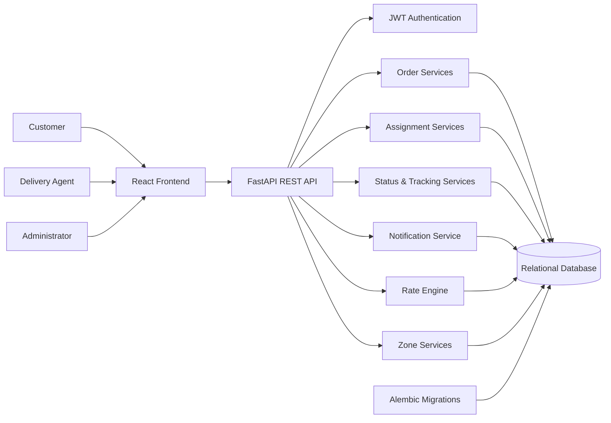
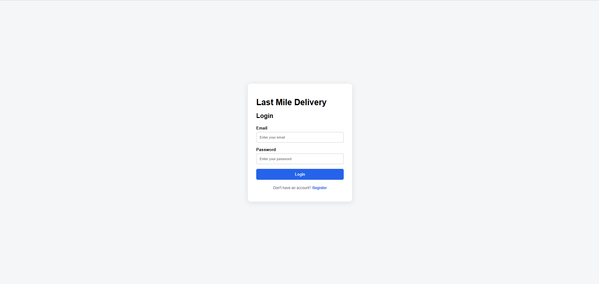
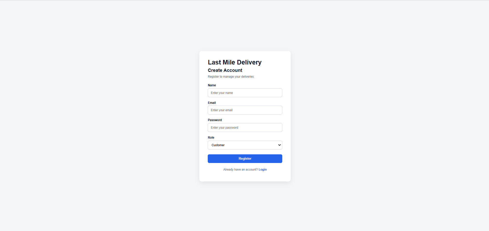
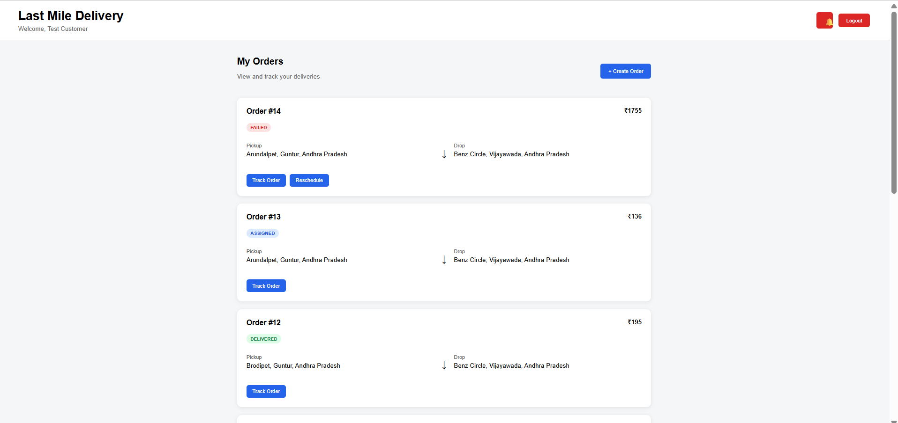
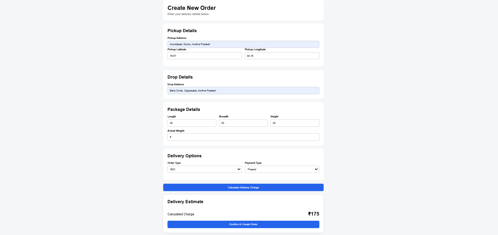
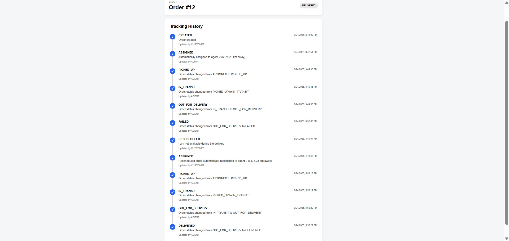
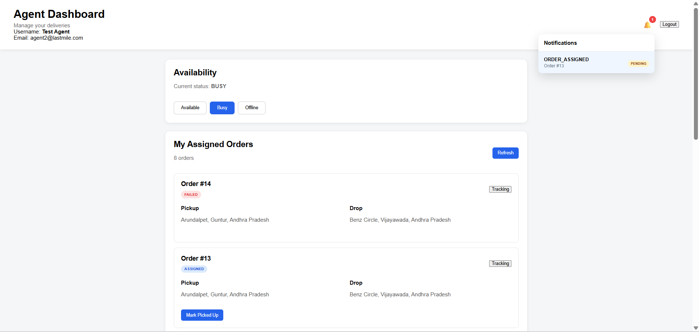
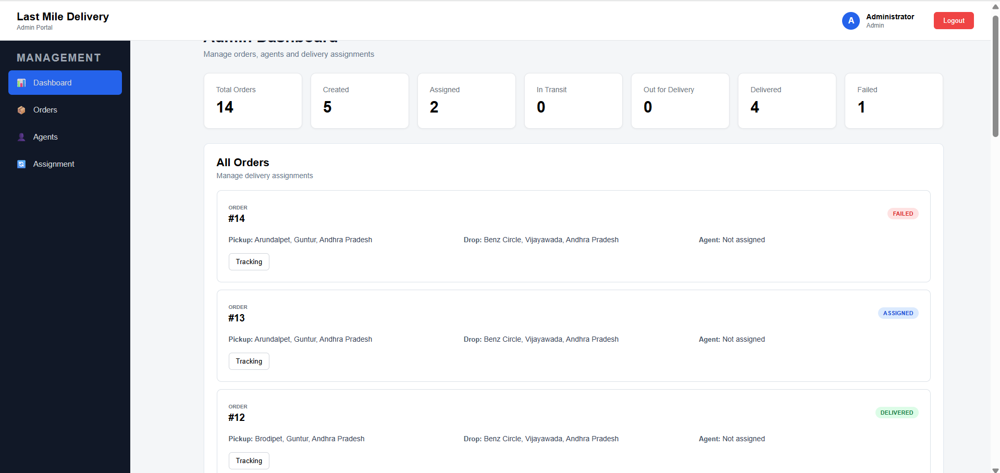
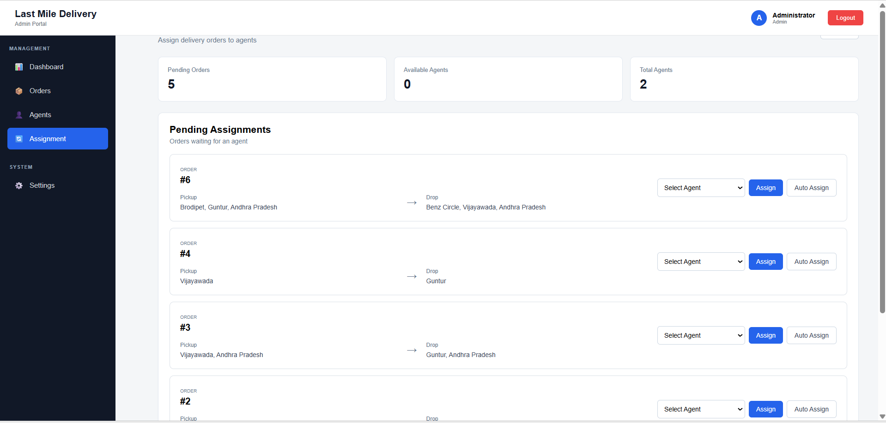

# 🚚 Last Mile Delivery Tracker

A full-stack **Last Mile Delivery Management System** for managing customers, delivery orders, agents, assignments, tracking, notifications, and delivery status transitions.

The application provides separate workflows for **Customers, Delivery Agents, and Administrators**, with a FastAPI backend, React frontend, JWT authentication, SQLAlchemy ORM, and database migrations through Alembic.

---

## ✨ Highlights

- 🔐 JWT-based authentication and role-based access
- 👤 Customer, Agent, and Admin workflows
- 📦 Create and manage delivery orders
- 💰 Delivery charge calculation
- 🚚 Agent availability management
- 🤝 Manual and automatic order assignment
- 🔄 Controlled order status transitions
- 📍 Order tracking history
- ❌ Failed-delivery handling with mandatory reason
- 🔔 In-app customer notifications
- 📊 Admin order/status overview
- 🧭 Dedicated dashboards for each role
- 🗄️ SQLAlchemy database models
- 🛠️ Alembic database migrations
- 🌐 RESTful API architecture
- ⚡ React + Vite frontend

---

## 🏗️ System Architecture



## 👥 User Roles

### Customer

Customers can:

- Register and log in
- Create delivery orders
- Calculate delivery charges
- View their orders
- Track order progress
- Reschedule failed deliveries
- View notifications
- Receive delivery/failure/reschedule event notifications

### Delivery Agent

Agents can:

- View their assigned orders
- View order tracking
- Change availability:
  - `AVAILABLE`
  - `BUSY`
  - `OFFLINE`
- Update delivery status
- Mark a delivery as failed with a reason
- Complete deliveries

### Administrator

Administrators can:

- View overall order statistics
- View all orders
- View agents
- Manage agent availability
- Manually assign orders
- Automatically assign eligible agents
- Review delivery assignments
- Track orders

---

## 📦 Core Order Workflow

```text
Customer
   │
   ▼
Create Order
   │
   ▼
Calculate Delivery Charge
   │
   ▼
Order Created
   │
   ▼
Admin Assignment
   │
   ├──────────────► Manual Assignment
   │
   └──────────────► Automatic Assignment
                       │
                       ▼
                    Assigned
                       │
                       ▼
                   Picked Up
                       │
                       ▼
                   In Transit
                       │
                       ▼
               Out for Delivery
                  │          │
                  │          └──────► Failed
                  ▼                     │
               Delivered               ▼
                                  Rescheduled
                                      │
                                      ▼
                                   Assigned
```

## 🛠️ Tech Stack

### Frontend

- React
- Vite
- React Router
- Axios
- JavaScript / JSX
- CSS

### Backend

- Python
- FastAPI
- SQLAlchemy
- Pydantic
- JWT authentication
- `python-jose`
- Password hashing
- Alembic

### Database

- Relational SQL database
- SQLAlchemy ORM
- Alembic migrations

---

## 📁 Project Structure

```text
last-mile-delivery-tracker/
│
├── backend/
│   ├── alembic/
│   │   └── versions/
│   │
│   ├── app/
│   │   ├── models/
│   │   │   ├── agent.py
│   │   │   ├── order.py
│   │   │   ├── notification.py
│   │   │   ├── tracking_history.py
│   │   │   ├── delivery_assignment.py
│   │   │   ├── reschedule_request.py
│   │   │   ├── rate_card.py
│   │   │   ├── zone.py
│   │   │   └── user.py
│   │   │
│   │   ├── routes/
│   │   │   ├── auth.py
│   │   │   ├── orders.py
│   │   │   ├── agent.py
│   │   │   └── admin.py
│   │   │
│   │   ├── schemas/
│   │   ├── services/
│   │   │   ├── order_service.py
│   │   │   ├── assignment_service.py
│   │   │   ├── status_service.py
│   │   │   ├── tracking_service.py
│   │   │   ├── notification_service.py
│   │   │   ├── rate_engine.py
│   │   │   └── zone_service.py
│   │   │
│   │   ├── utils/
│   │   ├── config.py
│   │   ├── database.py
│   │   └── main.py
│   │
│   ├── requirements.txt
│   ├── alembic.ini
│   └── seed.py
│
├── frontend/
│   ├── src/
│   │   ├── api/
│   │   ├── components/
│   │   ├── pages/
│   │   │   ├── customer/
│   │   │   ├── agent/
│   │   │   └── admin/
│   │   ├── App.jsx
│   │   └── main.jsx
│   │
│   ├── package.json
│   └── vite.config.js
│
├── docs/
│   └── screenshots/
│
└── README.md
```

---

## 🔐 Authentication & Authorization

Authentication is implemented using JWT bearer tokens.

```text
Login
  │
  ▼
Validate email/password
  │
  ▼
Generate JWT
  │
  ▼
Frontend stores token
  │
  ▼
Axios sends Bearer token
  │
  ▼
FastAPI validates token
  │
  ▼
Role-based access
```

Roles are used to protect customer, agent, and admin operations.

---

## 📍 Tracking

Every important order status change is recorded in tracking history.

Example:

```text
CREATED
   ↓
ASSIGNED
   ↓
PICKED_UP
   ↓
IN_TRANSIT
   ↓
OUT_FOR_DELIVERY
   ↓
DELIVERED
```

For a failed delivery:

```text
OUT_FOR_DELIVERY
        ↓
      FAILED
        ↓
   RESCHEDULED
        ↓
     ASSIGNED
```

Each tracking event records information such as status, actor, timestamp, and remarks.

---

## 💵 Delivery Charge Calculation

The order creation flow includes delivery charge calculation based on the order/package information configured by the backend rate engine.

The frontend collects:

- Pickup address
- Pickup coordinates
- Drop address
- Package dimensions
- Actual weight
- Order type
- Payment type

The calculated charge is then used when creating the order.

> Note: the current order model stores pickup coordinates. Drop coordinates should only be added to the system if route-distance/geospatial calculations require them.

---

## 🚚 Assignment

Administrators can assign orders in two ways.

### Manual Assignment

```text
Unassigned Order
       ↓
Select Available Agent
       ↓
Assign
       ↓
Order → ASSIGNED
```

### Automatic Assignment

```text
Unassigned Order
       ↓
Auto Assign
       ↓
Find Eligible Agent
       ↓
Assign Agent
       ↓
Order → ASSIGNED
```

Agent availability is considered during assignment.

---

## 🔔 Notifications

Notifications are stored as database records with states such as:

```text
PENDING
READ
```

Examples include:

- `DELIVERY_FAILED`
- `DELIVERY_RESCHEDULED`

The customer dashboard displays unread notifications through the notification bell.

---

# 🖥️ Application Screenshots

## Login



##Register



## Customer Dashboard



## Create Order



## Order Tracking



## Agent Dashboard



## Admin Dashboard



## Agent Assignment



---

## 🚀 Getting Started

### 1. Clone the repository

```bash
git clone <your-repository-url>
cd last-mile-delivery-tracker
```

### 2. Backend setup

```bash
cd backend

python -m venv venv
```

Windows:

```powershell
venv\Scripts\activate
```

Install dependencies:

```bash
pip install -r requirements.txt
```

Configure the environment variables required by the application.

Run database migrations:

```bash
alembic upgrade head
```

If seed data is required:

```bash
python seed.py
```

Start FastAPI:

```bash
uvicorn app.main:app --reload
```

Backend:

```text
http://127.0.0.1:8000
```

Swagger documentation:

```text
http://127.0.0.1:8000/docs
```

### 3. Frontend setup

Open another terminal:

```bash
cd frontend

npm install

npm run dev
```

Frontend:

```text
http://localhost:5173
```

---

## 🧪 Testing the Application

A typical end-to-end test can follow this sequence:

1. Register/login as a customer
2. Create an order
3. Verify the order appears in Customer Dashboard
4. Login as Admin
5. Open Assignment
6. Assign an available agent
7. Login as Agent
8. Verify the assigned order
9. Update the order status
10. Track the order from the customer side
11. Test a failed delivery
12. Verify the failure notification
13. Reschedule the failed order
14. Verify the notification and tracking history

---

## 🔌 Main API Areas

| Area | Purpose |
|---|---|
| `/auth` | Registration, login and current-user authentication |
| `/orders` | Customer order creation, calculation and order operations |
| `/agent` | Agent availability, assigned orders and delivery status |
| `/admin` | Orders, agents and assignments |
| Tracking services | Order status history |
| Notification services | Notification persistence and retrieval |

---

## 🧠 Important Design Decisions

### Shared status service

Order status changes are centralized rather than duplicating transition logic across routes.

### Explicit status transitions

The backend prevents invalid transitions such as:

```text
CREATED → DELIVERED
```

and requires the expected delivery lifecycle.

### Agent ownership checks

An agent can only update or view tracking for orders assigned to that agent.

### Transactional updates

Order changes, tracking events, agent availability updates, and notifications are persisted through the backend database workflow.

### Role-based API protection

Customer, agent, and administrator endpoints validate the authenticated user's role before performing protected operations.

---

## 📈 Future Improvements

Potential future enhancements include:

- Real map integration
- Geocoding for addresses
- Drop-location latitude/longitude
- Route-distance calculation using mapping APIs
- Live agent location tracking
- WebSocket-based real-time status updates
- Email/SMS notification delivery
- Advanced analytics
- Delivery ETA prediction
- Agent performance metrics
- Automated retry and escalation workflows
- Containerized deployment with Docker
- CI/CD pipeline

---

## 👨‍💻 Development Notes

The project is organized around a separation of concerns:

```text
Frontend
   ↓
API Routes
   ↓
Services / Business Logic
   ↓
SQLAlchemy Models
   ↓
Database
```

This keeps business rules such as assignment, pricing, tracking, notifications, and status transitions out of the UI layer and makes the backend easier to maintain and test.


## ⭐ Project Summary

**Last Mile Delivery Tracker** demonstrates a complete delivery-management workflow from order creation to final delivery, including role-based access, agent assignment, delivery tracking, failure handling, rescheduling, notifications, and administrative management.

Built with **React + FastAPI + SQLAlchemy + JWT + Alembic**.
